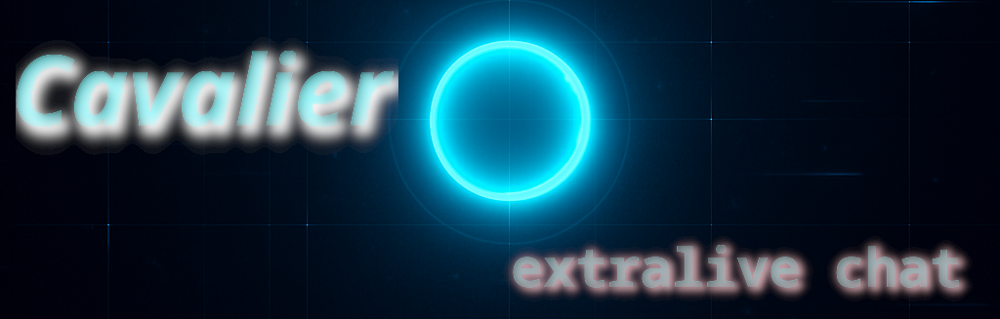

# Cavalier

### 💬 https://cavalier.samfield.net

Cavalier is an **extralive** chatroom. This means that in cavalier, keystrokes are reflected to all users in the chatroom in real time. No more prose, thoughtful messages, and user is typing messages. Embrace your typos, rash thoughts, and cavalier ideas. In Cavalier, all messages are anonymous and securely deleted when the server restarts. This is trivially accomplished, as messages are only stored in RAM. Jump on with some friends and try it out!

If you have any questions or concerns, please feel free to [open an issue](https://github.com/samfield1/cavalier/issues/new/choose). I would be happy to talk with anyone that is interested in this project.

### Development
To run and develop cavalier:
1. Clone the repository (`git clone https://github.com/samfield1/cavalier.git`)
2. Install [trunk](https://trunkrs.dev/)
3. Run the backend with `cavalier/backend$ cargo run`
4. Serve the forntend `cavalier/frontend$ trunk serve`

Trunk is configured to proxy requests to the backend.

### Production
Production builds of cavalier are available with the [frontend](ghcr.io/samfield1/cavalier-frontend:latest) and [backend](ghcr.io/samfield1/cavalier-backend:latest) docker images. The production environment of cavalier, https://cavalier.samfield.net, runs on k8s with a deployment of these docker images. The frontend is served with nginx, and the backend is served with axum. You must set an ingress or other configuration to direct requests to routes starting with `/api/` to the backend.

### TODO
This state of this app is a functional prototype, or proof of concept. It has only the most basic features to be functional and it has barely been tested. The next step in the development of this project is refactoring the monolithic `main.rs` files from the backend and frontend into legible, consistent, and organized components. Each of them are littered with `TODO: ` comments on what must be done next.

### License
Cavalier is provided under the GNU Affero General Public License version 3. See [LICENSE.md](/LICENSE.md) for more details

